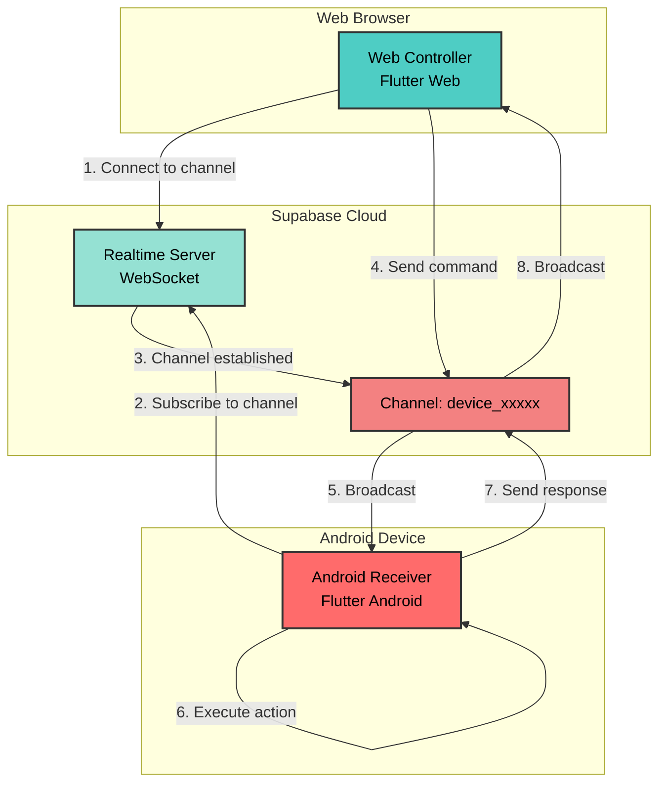
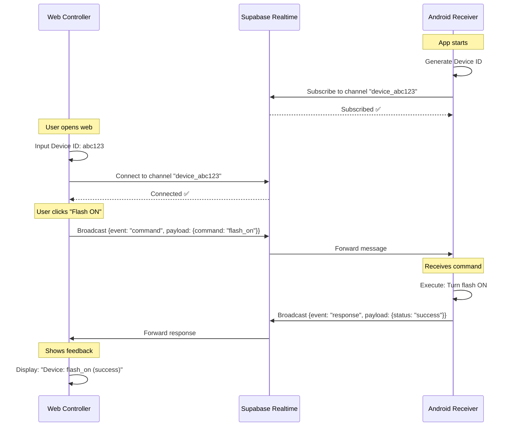
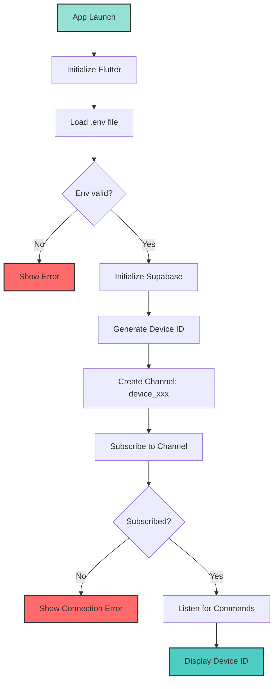
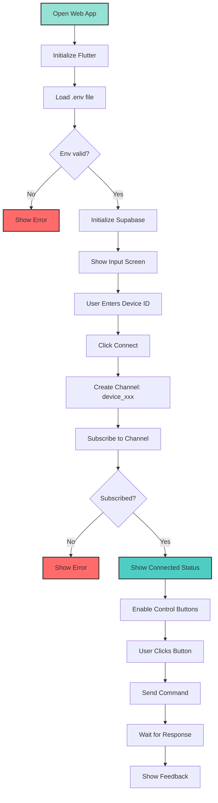

# 🏗️ Architecture & Flow Diagram

Diagram arsitektur dan alur komunikasi aplikasi Remote Control.

## 📊 System Architecture



## 🔄 Message Flow



## 🎯 Channel Naming Convention

```
Channel Format: device_{deviceId}

Example:
- Device ID: abc12345
- Channel Name: device_abc12345
```

**Important**:
- ✅ Channel name harus **SAMA PERSIS** antara web dan Android
- ✅ Case-sensitive: `device_ABC` ≠ `device_abc`
- ✅ Format konsisten mencegah connection issues

## 📨 Message Structure

### Command Message (Web → Android)

```json
{
  "event": "command",
  "payload": {
    "command": "flash_on" | "flash_off" | "vibrate" | "play_sound"
  }
}
```

### Response Message (Android → Web)

```json
{
  "event": "response",
  "payload": {
    "status": "success" | "error",
    "command": "flash_on",
    "timestamp": "2025-12-03T09:50:00Z",
    "error": "Error message (if status=error)"
  }
}
```

## 🔐 Security Layers

```mermaid
graph LR
    A[Source Code] --> B[Environment Variables]
    B --> C[Code Obfuscation]
    C --> D[HTTPS/WSS Connection]
    D --> E[Supabase RLS]
    E --> F[Rate Limiting]
    
    style A fill:#FFE66D,stroke:#333,stroke-width:2px
    style B fill:#FF6B6B,stroke:#333,stroke-width:2px
    style C fill:#4ECDC4,stroke:#333,stroke-width:2px
    style D fill:#95E1D3,stroke:#333,stroke-width:2px
    style E fill:#F38181,stroke:#333,stroke-width:2px
    style F fill:#AA96DA,stroke:#333,stroke-width:2px
```



### Layer Descriptions:

1. **Environment Variables** (.env files)
   - Credentials tidak hardcoded
   - Tidak di-commit ke Git

2. **Code Obfuscation**
   - Class & function names di-scramble
   - Sulit di-reverse engineer

3. **HTTPS/WSS Connection**
   - Encrypted communication
   - TLS 1.2+

4. **Supabase RLS** (Optional)
   - Row-level access control
   - Custom policies

5. **Rate Limiting**
   - Prevent abuse
   - DDoS protection

## 🏃 Application Flow

### Android Receiver Startup



### Web Controller Flow



## 🗂️ Project Structure

```
remote_control_app/
│
├── web_controller/              # Flutter Web Application
│   ├── lib/
│   │   ├── config/
│   │   │   └── env_config.dart    # 🔐 Environment config
│   │   └── main.dart              # 🎨 UI & control logic
│   ├── .env                       # 🔒 Credentials (gitignored)
│   ├── .env.example               # 📋 Template
│   └── pubspec.yaml               # 📦 Dependencies
│
├── android_receiver/            # Flutter Android Application  
│   ├── lib/
│   │   ├── config/
│   │   │   └── env_config.dart    # 🔐 Environment config
│   │   └── main.dart              # 📱 Receiver logic
│   ├── .env                       # 🔒 Credentials (gitignored)
│   ├── .env.example               # 📋 Template
│   └── pubspec.yaml               # 📦 Dependencies
│
└── Documentation/
    ├── SECURITY.md                # 🔒 Security guide
    ├── README.md                  # 📖 Main documentation
    ├── SUPABASE_SETUP.md          # ⚙️ Supabase config
    ├── SUPABASE_CHECKLIST.md      # ✅ Quick checklist
    ├── QUICK_REFERENCE.md         # 🚀 Command reference
    └── ARCHITECTURE.md            # 🏗️ This file
```

## 🎭 Command Types & Actions

| Command | Web Button | Android Action | Requirements |
|---------|-----------|----------------|--------------|
| `flash_on` | Flash ON | Turn flashlight ON | Camera permission |
| `flash_off` | Flash OFF | Turn flashlight OFF | Camera permission |
| `vibrate` | Vibrate | Vibrate device 500ms | Vibration hardware |
| `play_sound` | Play Sound | Play ping.mp3 | Audio file in assets |

## 🌐 Network Requirements

```
Client (Web/Android) <--WebSocket--> Supabase Realtime
                     <--HTTPS--> Supabase API

Protocol: WSS (WebSocket Secure)
Port: 443 (HTTPS/WSS)
Connection: Persistent (keep-alive)
```

**Firewall Requirements**:
- ✅ Allow outbound HTTPS (port 443)
- ✅ Allow WebSocket connections
- ✅ No special inbound ports needed

## 📈 Scalability Considerations

### Current Setup (Free Tier)

- **Concurrent Connections**: Up to 200
- **Messages per month**: 2 million
- **Bandwidth**: 500MB

### If Scaling Needed

1. **Horizontal Scaling**
   - Multiple Android receivers per channel
   - Load balancing via channel routing

2. **Message Optimization**
   - Compress payloads
   - Batch commands
   - Use message throttling

3. **Channel Management**
   - Cleanup inactive channels
   - Implement timeout logic
   - Auto-reconnect on disconnect

## 🔍 Debugging Tips

### Enable Debug Logging

```dart
// Add to main.dart
import 'dart:developer' as developer;

Supabase.initialize(
  url: EnvConfig.supabaseUrl,
  anonKey: EnvConfig.supabaseAnonKey,
  debug: true, // 👈 Enable verbose logging
);
```

### Monitor Network Traffic

Use Chrome DevTools:
1. Open DevTools (F12)
2. Go to **Network** tab
3. Filter by **WS** (WebSocket)
4. Watch messages in real-time

### Supabase Dashboard

1. Go to **Database → Realtime Inspector**
2. View active channels
3. Monitor message flow
4. Check connection count

---

**💡 Pro Tip**: Bookmark this file untuk quick reference tentang bagaimana aplikasi bekerja!
